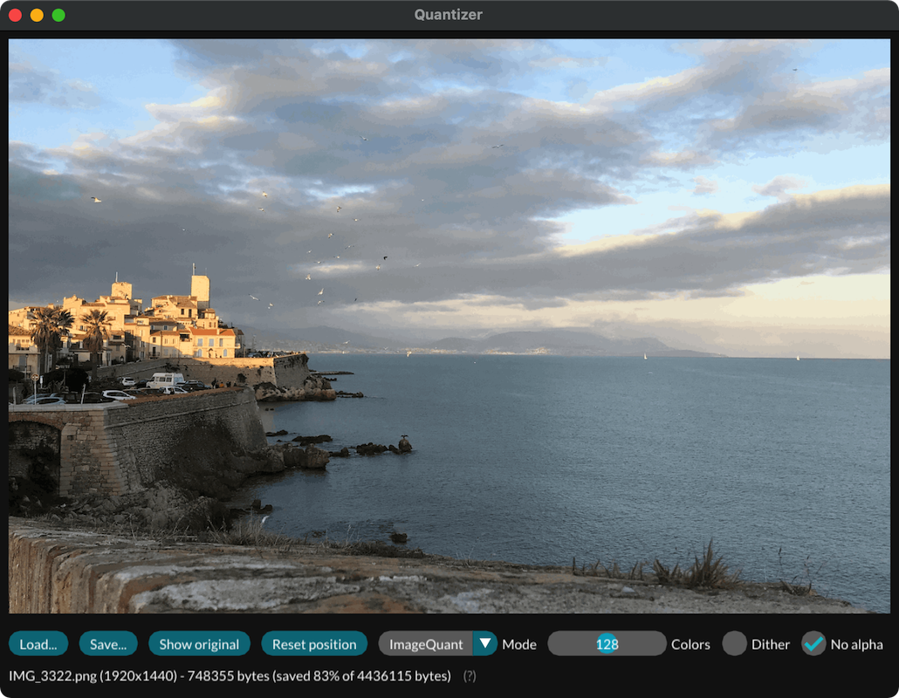

# Quantizer 

The Quantizer is a PNG-quantization tool strongly inspired by [ImageAlpha](https://pngmini.com).
It uses the same existing algorithms: [PngQuant](https://pngquant.org/lib/), [Posterizer](https://github.com/kornelski/mediancut-posterizer) and [pngnq](http://pngnq.sourceforge.net) to transform any PNG into a 8-bit palettized image. This is an efficient way of generating a smaller image file while preserving perceptual quality. Please see the `LICENSE_EXTERNAL.md` file for the libraries respective licenses.

Both a command line tool and a GUI application are provided.

## Features

* Three quantization algorithms.
* Custom number of colors in the palette.
* Support for dithering.
* Support for removing the alpha channel of an image.
* Compare the size of your image before and after.
* Zoom and pan the generated image, compare it with the source.
* Drag and drop an image to process it.

## Command line use

- `--i,--in <path(s) to file(s)>`  
    Image(s) to quantize
- `--o,--out <path(s) to file(s)>`  
    Destination path(s). If empty, will use input path + timestamp or the input path itself if `--force` enabled
- `--f,--force`  
    Output in place if no output path specified, erasing input file(s) if present (disabled by default)

### Settings
- `--m,--mode <(0: ImageQuant, 1: PngNeuQuant, 2: Posterizer)>`  
    Compressor to use (defaults to ImageQuant)
- `--c,--colors <in 2,256>`  
    Number of colors in the palette (defaults to 256)
- `--d,--dither`  
    Should dithering be applied (disabled by default)
- `--na,--no-alpha`  
    Remove alpha channel (disabled by default)

### Infos

- `--v,--version`  
    Displays the current Thoth version.
- `--license`  
    Display the license message.
- `--license-ext`  
    Display the dependencies license messages.

## Future improvements

* Improve zooming (filtering mode,...).
* Add support for pngcrush.

